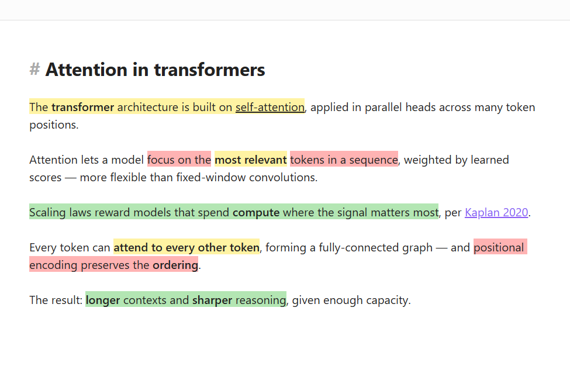
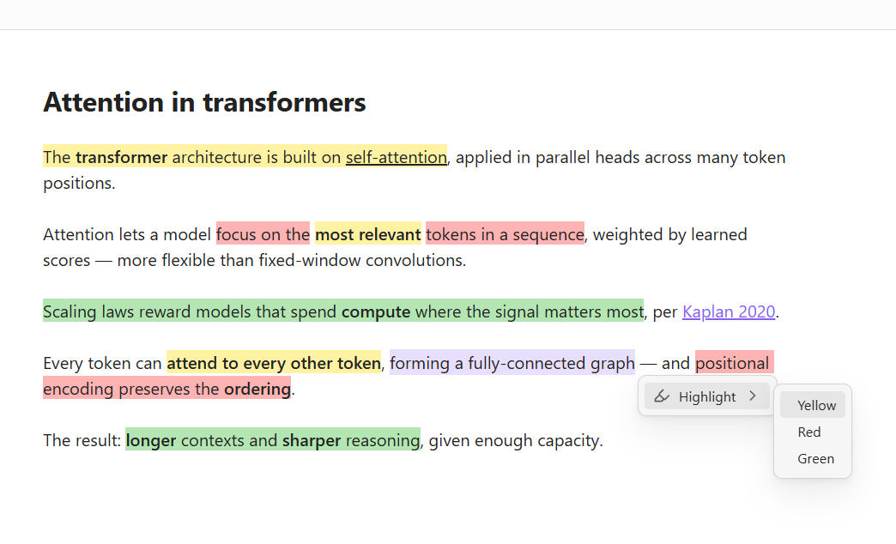
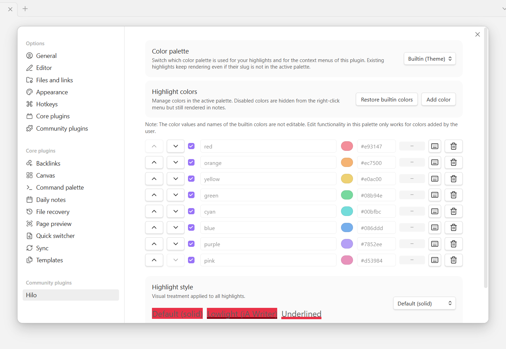
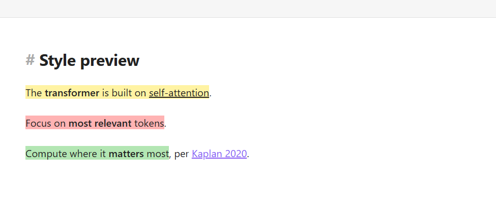
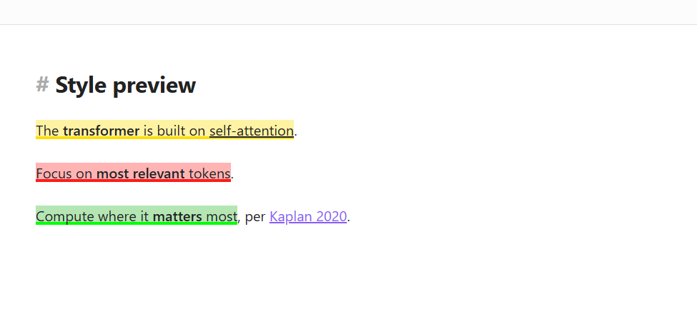
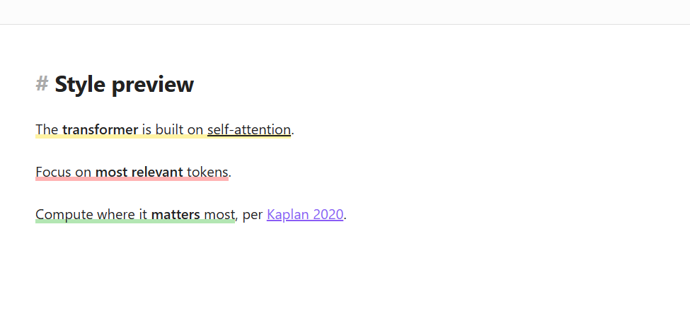

> **English** · [한국어](README.ko.md)

# Hilo — Native Multi-color Highlights for Obsidian

> A multi-color highlight plugin that **doesn't break inline markdown**. Powered by Obsidian's native `==text==` syntax.

`Hilo` blends **Hi**ghlight + **Lo**wlight, and means "thread" in Spanish — reflecting the plugin's philosophy of weaving color into your notes without breaking markdown's natural flow.

▶ **[Watch the 39-second demo on YouTube](https://youtu.be/fLbVhfi5H6c)**

---

## Why Hilo

`<mark>` HTML-based highlight plugins lose inline markdown inside the mark because Obsidian doesn't parse the contents — so `**bold**`, `[[wikilinks]]`, and `*italics*` render as raw text. Hilo sidesteps this by adding only a color token (`{slug}`) to Obsidian's already-recognized `==text==` syntax.

| | Hilo | `<mark>`-based plugins |
|---|---|---|
| `=={red}**bold text**==` | ✅ renders correctly | ❌ `**` shows as literal |
| `=={blue}[[wikilink]]==` | ✅ link works | ❌ link not recognized |
| Note portability | ✅ slug (`yellow`) only — hex lives in settings | ❌ hex baked into the note |
| Export compatibility | ✅ `==text==` is a CommonMark extension | △ `<mark>` is also standard, but tokens leak |
| Bundle size | ✅ ~8 KB | ❌ tens to hundreds of KB |

---

## Features

### Multi-color highlights (`=={color}text==`)
- Slug-based color reference. The markdown source stores only the semantic name; hex values live in plugin settings.
- Inline markdown (`**bold**`, `[[wikilinks]]`, `*italics*`) works correctly inside a highlight.

### Consistent rendering across views
- **Source mode / Live Preview / Reading view** all render highlights identically.
- In Live Preview the `{color}` token is hidden automatically; placing the cursor on the token reveals it for editing.

### Right-click context menu

- **Highlight** → pick a color: wraps the selection
- **Change color** → swap to another color
- **Unhighlight**: removes the marker and token

### Keyboard commands
- Per-color wrap commands (e.g. `Hilo: Yellow`, `Hilo: Red`)
- `Hilo: Open color palette` — opens the context-aware menu at the caret
- `Hilo: Unhighlight`

Assign hotkeys in **Settings → Hotkeys**. Each color row in **Settings → Hilo** also shows the currently assigned hotkey, and the keyboard button (⌨) jumps straight to the Hotkeys page.

### Color customization

- **Color palette dropdown** — switch between two catalogs of colors:
  - **Builtin (Theme)** — 8 colors tied to Obsidian's theme (`--color-red` through `--color-pink`). Change themes and highlights follow. Rows are locked (theme owns the values); you can still add your own custom colors on top.
  - **Custom** — starts with 3 pastels (yellow / red / green); fully editable.
- Both palettes coexist. Highlights written under one palette still render if you switch to another — the plugin merges color maps and lets the active palette win on slug conflicts.
- **Per-color row** — enable/disable, reorder with arrows, edit slug + hex, assign a hotkey (⌨ jumps to Obsidian's Hotkeys page), or delete.
- Disabled colors are hidden from menus but existing highlights keep rendering.

### Visual styles

Three ways to render highlights, switchable under **Settings → Hilo → Highlight style**:

- **Default (solid)** — the color fills the whole text region, like a classic highlighter marker.

  

- **Lowlight (iA Writer)** — subtle background with a darker underline; the underline color is auto-computed from each background via HSL (hue preserved, saturation 100%, lightness −30pp).

  

- **Underlined** — a thin band of color at the bottom of the text, no fill. Works cleanly on both light and dark themes.

  

Both Lowlight and Underlined use `box-shadow` for the color band instead of `text-decoration`, so they aren't overridden by Chromium's spellcheck.

### Highlightr migration
- The context menu also works on existing `<mark style="...">text</mark>` highlights.
- **Change color** rewrites them to `=={slug}text==`.
- **Unhighlight** strips the mark tag.
- No bulk conversion required — migrate progressively as you touch each note.

---

## Installation

### Obsidian Community Plugins
1. **Settings → Community plugins → Browse**
2. Search for "Hilo" → **Install** → **Enable**

### Manual install
1. Download the latest release from the [Releases](https://github.com/opellen/Hilo/releases) page
2. Copy `main.js`, `manifest.json`, and `styles.css` into your vault's `.obsidian/plugins/hilo/` folder
3. Enable **Hilo** under **Settings → Community plugins**

---

## Usage

### Basic highlight
1. Select text
2. Right-click → **Highlight** → pick a color
3. Or use a per-color hotkey

The selection becomes `=={color}text==` and the color renders immediately.

### Change color
1. Place the cursor inside an existing highlight
2. Right-click → **Change color** → pick a new color

### Remove highlight
1. Place the cursor inside the highlight
2. Right-click → **Unhighlight** (or use the hotkey)

### Add a color
1. **Settings → Hilo**
2. Pick a palette (Builtin accepts additions on top of the 8 theme colors; Custom is fully editable)
3. Click **Add color**
4. Enter a slug (e.g. `pink`) and a hex value (e.g. `#ffc0cb`)
5. The new color is available in every view immediately.

### Migrating from Highlightr
Place the cursor on an existing `<mark>` highlight and right-click — the same menu appears. Use **Change color** to convert it to the Hilo token format, or **Unhighlight** to remove it.

---

## Token format

Hilo's output format is the single inline form `=={color}content==`.

- The color slug is lowercase alphanumeric plus hyphens (e.g. `yellow`, `red`, `1st`, `2nd`, `soft-blue`).
- The slug may start with a letter or a digit.
- If the slug isn't in your settings catalog, the highlight falls back to Obsidian's native `==text==` yellow — no broken rendering, just an untinted visible highlight.

> **Exporting outside Obsidian**: external markdown renderers may show the `{color}` token as literal text. If you publish to such renderers, strip tokens before export (automatic stripping is a future option).

---

## Visual styles

### Default (solid background)
The configured background color fills the entire highlight area.

### Lowlight (iA Writer style)
- Subtle background tint plus a per-color darker underline
- Readable while still clearly differentiated by color
- Underline color is recomputed automatically whenever you add or edit a color

Set under **Settings → Hilo → Highlight style**.

---

## Localization

Hilo automatically picks up Obsidian's interface language.

- **Supported languages**: English (default), Korean (한국어)
- Detection: Obsidian's `localStorage` `language` key
- Unsupported languages fall back to English

### Reloading after a language change

After changing the language under **Settings → About → Language**, **toggle the plugin off and on** (Settings → Community plugins → Hilo) so the command palette names (e.g. `Hilo: Open color palette`) pick up the new language. Obsidian freezes command names at registration time. The settings UI, right-click menu, and modals update without a reload.

### Contributing a translation

To add a language, copy `src/i18n/locales/en.ts` as a new locale file under `src/i18n/locales/`, translate the values, and register the new entry in `src/i18n/index.ts`'s dictionary map.

---

## Compatibility

- Obsidian 1.5.0 or newer
- Desktop + mobile (mobile is in beta — feedback welcome)
- All Obsidian view modes (Source / Live Preview / Reading)
- Light and dark themes

---

## Intentionally out of scope

The following features are deliberately omitted to keep Hilo focused. They may be revisited based on user feedback:

- Annotations / notes attached to highlights
- Sidebar list of highlights (NotesTab)
- Drag-to-reorder colors

---

## Credits

Hilo's right-click menu structure, settings UI flow, and visual style catalog are inspired by [Chetachi](https://github.com/chetachiezikeuzor)'s [Highlightr](https://github.com/chetachiezikeuzor/Highlightr-Plugin) and [Highlightr+](https://github.com/chetachiezikeuzor/highlightr-plus). They pioneered multi-color highlighting in Obsidian; Hilo borrows their patterns while swapping the output format for native `==text==`.

---

## Built with

Hilo was scaffolded with [Scaff](https://github.com/opellen/Scaff) — a lightweight, markdown-based AI development harness. Every iteration (phase-by-phase build, marketplace review, demo assets) was tracked as plain-file `CONTEXT.md` / `GOAL.md` / `ROADMAP.md`, without any CLI, hooks, or MCP.

---

## License

[MIT](LICENSE)
